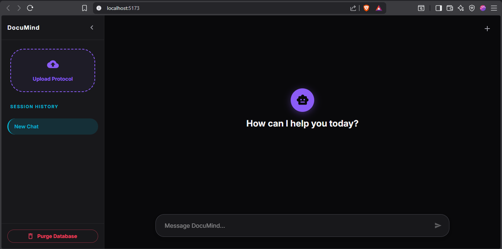
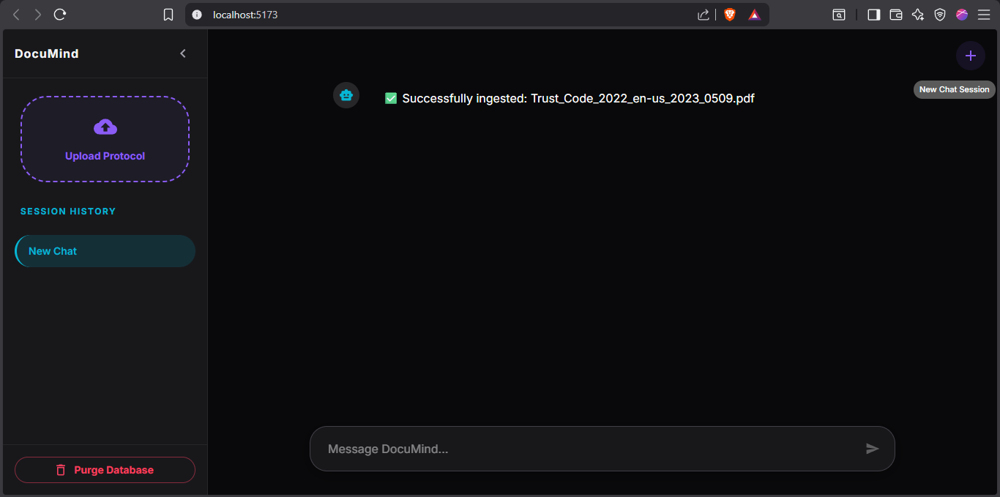
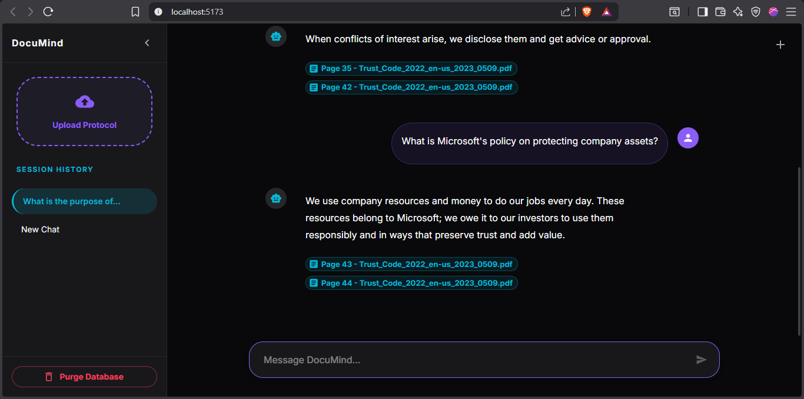
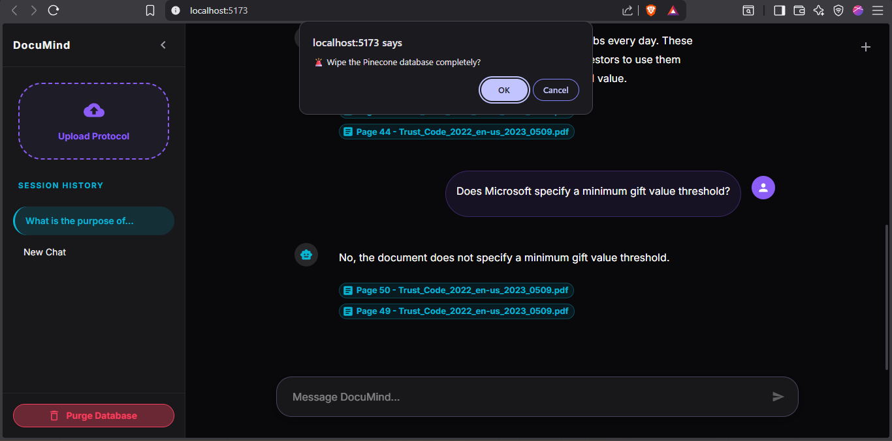

# 🌌 DocuMind Enterprise: Context-Aware RAG Protocol

**DocuMind Enterprise** is a production-ready, RAG-based assistant designed to ingest corporate documents and provide strict, context-aware responses with real-time streaming and citation tracking.

---

## 🖼️ Project Showcase

### 01. Intuitive Landing Experience
The "Midnight Aurora" theme provides a clean, focused environment for enterprise document analysis.

### 02. Seamless Data Ingestion
Successfully process and vectorize complex enterprise documents into the Pinecone database with real-time feedback.

### 03. Precision RAG with Paged Citations
Get accurate answers with clickable citations that point directly to the source page, ensuring data transparency.

### 04. Advanced Database Control & Privacy
Manage your vector index with security-first features like "Brain Wipe" and full database purging.

---

## 📂 Project Architecture

### Backend (FastAPI)
A modular architecture built for scalability and separation of concerns.
- **`documind_enterprise_backend/main.py`**: Entry point and route registration.
- **`api/`**: Contains `chat_routes.py` for streaming and `doc_routes.py` for indexing.
- **`services/`**: Houses `chat_engine.py` (RAG logic) and `ingest_engine.py` (PDF parsing).
- **`schemas/`**: Pydantic models for strict API request validation.

### Frontend (React + Vite)
A minimalist, Gemini-inspired UI with a dark "Midnight Aurora" theme.
- **`documind_enterprise_frontend/src/App.jsx`**: Manages global state and sidebar toggles.
- **`components/Sidebar.jsx`**: Handles document uploads and session history.
- **`components/ChatWindow.jsx`**: Features real-time streaming and Markdown rendering.

---

## 🚀 Key Features
- **Unstructured Parsing**: Mandated `UnstructuredPDFLoader` for high-accuracy document layout analysis.
- **Real-time Streaming**: Instant token delivery via Server-Sent Events (SSE).
- **Session Intelligence**: Independent chat histories maintained via a session-based memory dictionary.
- **Strict Guardrails**: Zero-inference answering—AI only responds using provided document context.

---

## ⚙️ Setup Instructions

### Backend Setup
1. `cd documind_enterprise_backend`
2. `pip install -r requirements.txt`
3. Configure `.env` with `GROQ_API_KEY` and `PINECONE_API_KEY`.
4. `python main.py`

### Frontend Setup
1. `cd documind_enterprise_frontend`
2. `npm install`
3. `npm run dev`

---
**Developed by [maCkey023](https://github.com/maCkey023)**.